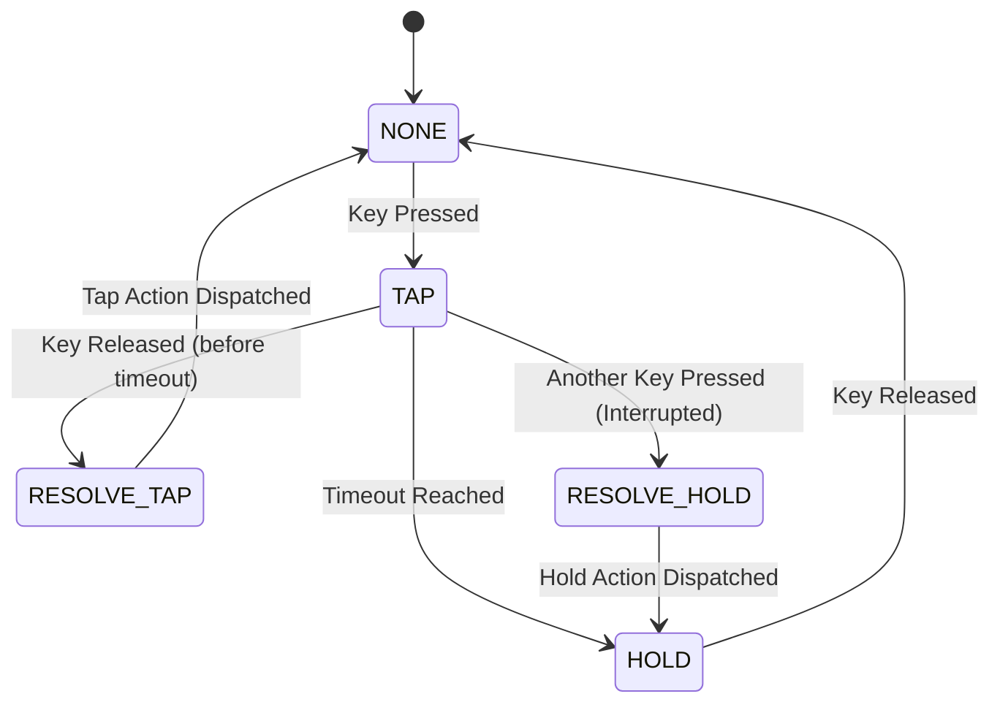
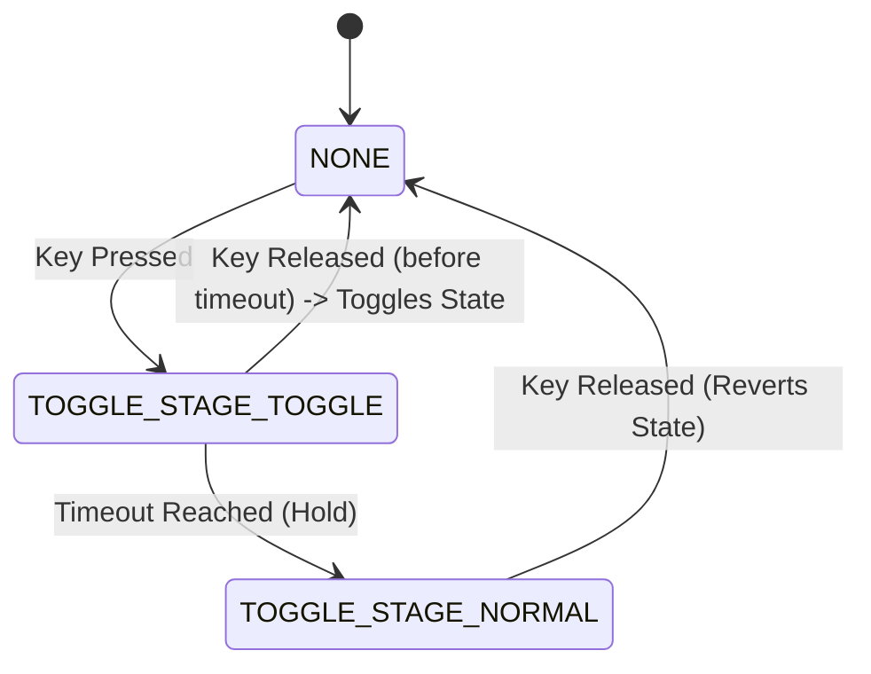
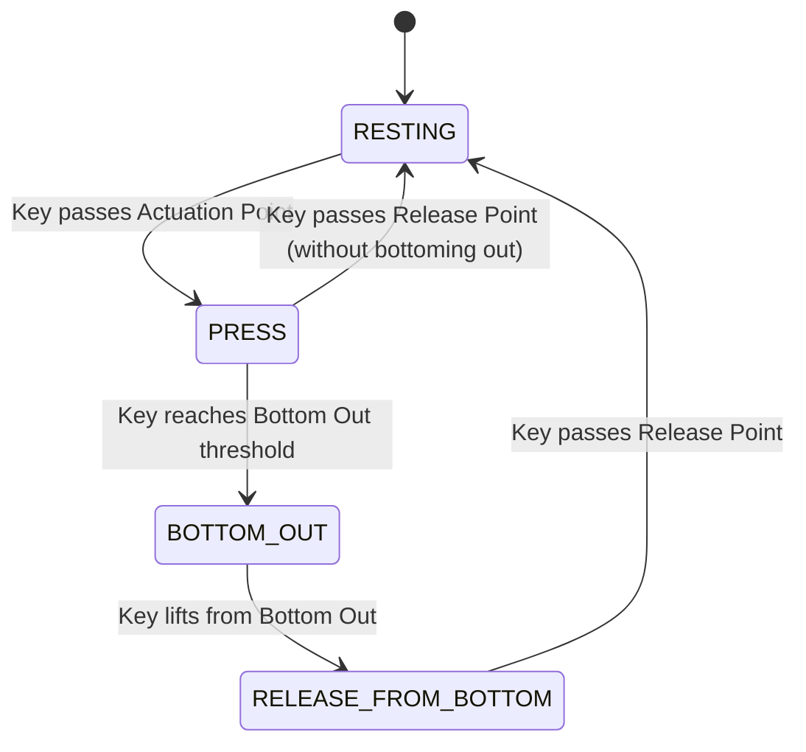
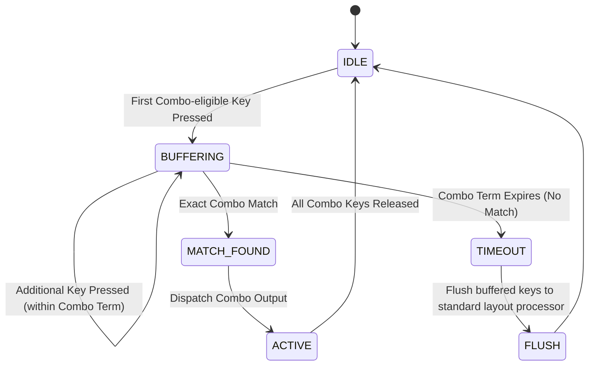
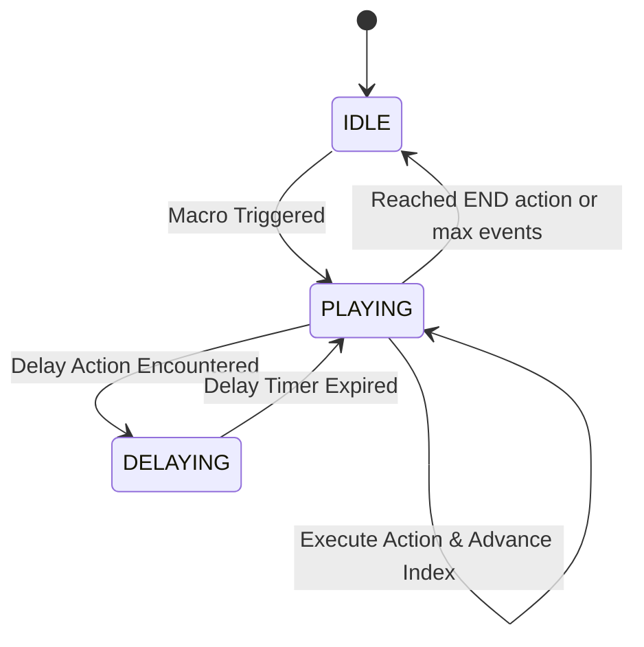

# Advanced Keys Architecture

This document describes the internal state machines and lifecycle for Advanced Keys in `libhmk/src/advanced_keys.c`.

## Tap-Hold

A Tap-Hold key sends one keycode if tapped, and a different one if held. It relies on a time threshold (Hold Timeout) to transition states, or can be forced to resolve early by other key events.

## Toggle

Toggle keys alternate between a toggled state and a non-toggled state on tap. If held past a timeout, they behave as a normal momentary key.

## Dynamic Keystroke (DKS)

Dynamic Keystroke triggers different actions based on traversal through the keystroke: Press, Bottom Out, Release from Bottom Out, and Full Release.

## Combo Engine

The combo engine buffers incoming key presses for a short duration (`DEFAULT_COMBO_TERM = 50ms`) to see if they match a configured chord.

## Macro Engine

The macro engine executes a sequence of recorded actions (Tap, Press, Release, Delay). 

